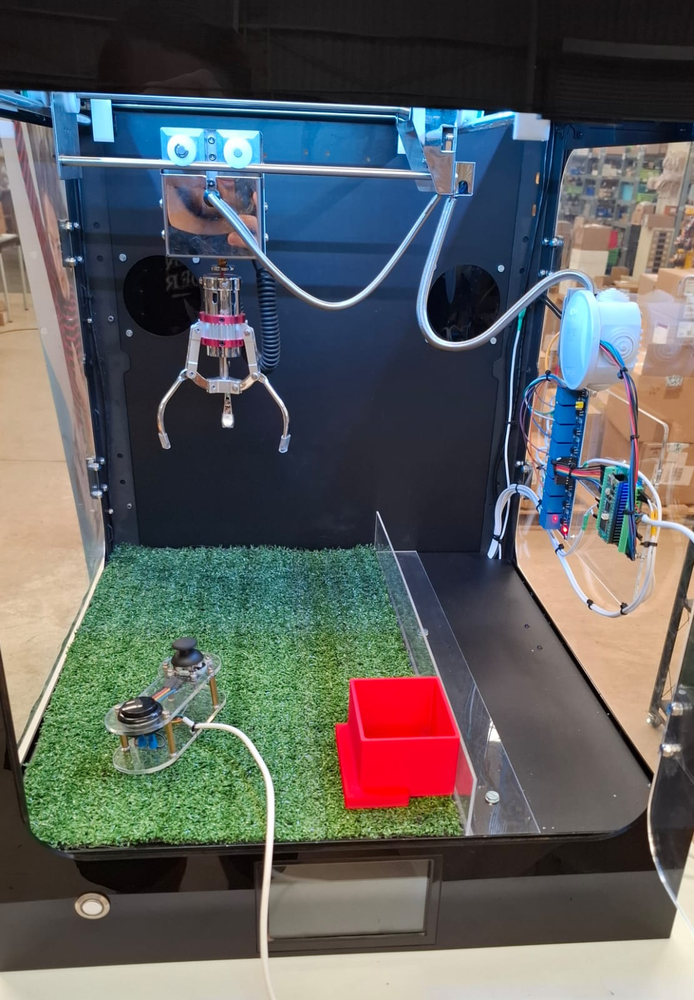
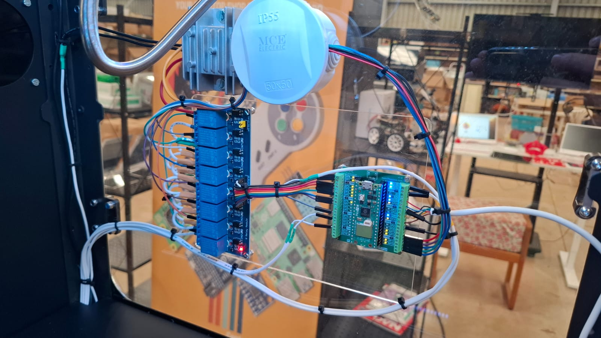
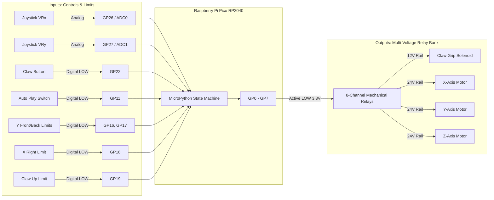

# Custom Mechanical Claw Machine

A fully functional mechanical claw machine driven by a Raspberry Pi Pico and MicroPython. This project bridges physical hardware integration, clever electrical engineering, and synchronous control software into a unified system.

## 📸 Project Showcase

This project is fully assembled and operational. Below are views of the complete physical casing and the internal electronics.

  
   
  <em>Completed external assembly.</em>

 

  
   
  <em>The "brain" (Raspberry Pi Pico) and the custom multi-voltage relay routing.</em>

---

## 🛠️ Key Engineering Features

* **Hardware Reverse-Engineering:** Successfully adapted and reverse-engineered an imported 3-axis commercial gantry to interface with custom microcontrollers.
* **Custom Relay H-Bridge Control:** Bypassed the need for specialized high-voltage motor drivers by architecting a custom bidirectional motor control system using an array of mechanical relays.
* **Multi-Voltage Architecture:** Designed a robust 4-tier power distribution system (24V, 12V, 5V, 3.3V) to safely isolate logic signals, MCU power, and heavy mechanical loads.
* **Thermal Management:** Strategically under-volted the main claw actuator to 12V to drastically reduce heat buildup during continuous, high-duty-cycle operation.
* **Synchronous MicroPython Logic:** A real-time control loop running on a Raspberry Pi Pico manages all state machines and mechanical interactions.

---

## ⚡ Electronics & Hardware Specifications

The core of this build is a highly customized electronics stack. Power routing, thermal management, and directional control were engineered from scratch using discrete relay logic across four distinct voltage domains.

| Voltage Domain | Component / Function | Engineering Notes |
| :--- | :--- | :--- |
| **24V Power Rail** | **Gantry Motors (X, Y, Z)** | Provides the high torque & speed necessary for moving the mechanical gantry. |
| **12V Power Rail** | **Claw Solenoid Actuator** | *Thermal Mitigation:* Intentionally under-volted to 12V to prevent thermal runaway and coil burnout while due to high duty cycle. |
| **5V Power Rail** | **MCU Power** | Dedicated clean power supply stepping down to run the Raspberry Pi Pico. |
| **3.3V Logic Level** | **Control Signals & Relays** | Pure logic routing from the Pico's GPIO pins to trigger the relay boards and read limit switch states. |

### Motor Control (The Relay Hack)
Instead of standard H-Bridge motor drivers (which couldn't handle the 24V requirement on hand), motor direction is achieved via an 8-Channel Mechanical Relay Module.

Each motor utilizes two relays (one per terminal). The Normally Open (N/O) is wired to 24V, and Normally Closed (N/C) to GND. By mirroring this on the pair, motor direction is controlled purely by flipping relay states, effectively creating a mechanical H-bridge.

 

<strong>Wiring Diagram & Pinout Reference</strong>

 

The logic routing is handled by a Raspberry Pi Pico. Below is the exact pinout configuration driving the inputs (sensors/joystick) and outputs (relay bank).

### Raspberry Pi Pico Pin Mapping

| Component | Function | Pico Pin | Signal Type |
| :--- | :--- | :--- | :--- |
| **Relay: Claw Grip** | Activates the 12V claw solenoid | `GP0` | Output (Active LOW) |
| **Relay: Z-Axis Pole 2** | Claw motor directional control | `GP1` | Output (Active LOW) |
| **Relay: Z-Axis Pole 1** | Claw motor directional control | `GP2` | Output (Active LOW) |
| **Relay: X-Axis Pole 2** | X motor directional control | `GP3` | Output (Active LOW) |
| **Relay: X-Axis Pole 1** | X motor directional control | `GP4` | Output (Active LOW) |
| **Relay: Y-Axis Pole 2** | Y motor directional control | `GP5` | Output (Active LOW) |
| **Relay: Y-Axis Pole 1** | Y motor directional control | `GP6` | Output (Active LOW) |
| **Relay: Main Power** | System power toggle / safety | `GP7` | Output (Active LOW) |
| **Switch: Auto Play** | Enables Auto Play sequence | `GP11` | Input (Pull-Up) |
| **Limit Switch: Y Back** | Y-Axis max backward travel | `GP16` | Input (Pull-Up) |
| **Limit Switch: Y Front**| Y-Axis max forward travel | `GP17` | Input (Pull-Up) |
| **Limit Switch: X Right**| X-Axis max right travel (Home) | `GP18` | Input (Pull-Up) |
| **Limit Switch: Z Up** | Z-Axis max upward travel | `GP19` | Input (Pull-Up) |
| **Joystick: Button** | Manual claw drop/grab | `GP22` | Input (Pull-Up) |
| **Joystick: X-Axis** | X-Axis analog position | `GP26 (ADC0)` | Analog Input |
| **Joystick: Y-Axis** | Y-Axis analog position | `GP27 (ADC1)` | Analog Input |
| **Switch: SW Mode** | Auxiliary Switch | `GP28` | Input (Pull-Up) |

### System Architecture Diagram

---

## 💻 Software Implementation (MicroPython)

The entire software stack is written in **MicroPython**. Because the system uses mechanical relays instead of standard PWM motor drivers, the software relies on precise 3.3V GPIO state management to sequence the hardware without creating dead-shorts across the 24V rail.

1.  **Gantry Motion & Relay Sequencing:** Precise GPIO logic switching to activate pairs of mechanical relays, controlling both the movement and direction of the X, Y, and Z axes.
2.  **Actuator Sequencing:** Managing the timing and activation of the 12V solenoid for gripping and releasing.
3.  **Homing & Calibration:** Automatic initialization routine to find 'zero' using limit switch feedback.